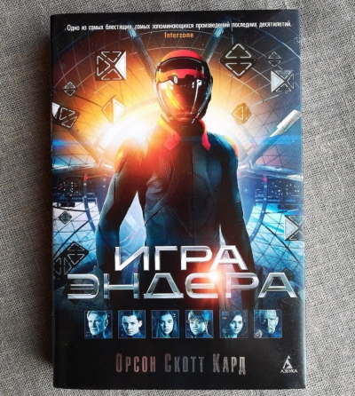
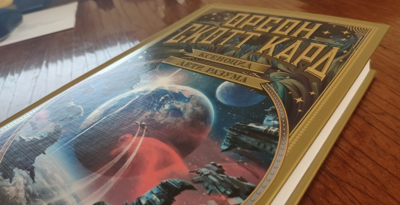
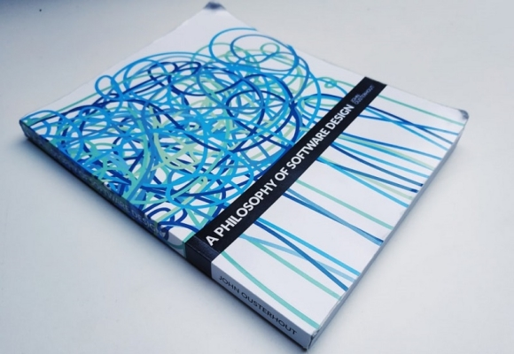

В этом году я прочитал 7 книг. Мне очень повезло, все книги оказались полезными и интересными. Не было ни одной, которую я забыл. Перед выбором книг были изучены отзывы по ним. Я стараюсь читать только проверенные книги.  
В этот список входит: техническая, художественная и философская литература.
 <!--more-->

## Художественная литература

### Орсон Скотт Кард - "Игра Эндера"

В этом году мне хотелось почитать фантастику, поэтому по отзывам выбрал эту книгу. Она рассказывает о молодости Эндера - гениального ребенка, которого воспитывают полководцем всей человеческой армии. Причем гениален не только он, но и его родные сестра и брат. Своими поступками они способны изменить мир.  
В этой книге меня захватили гениальные мысли главного героя, его брата и сестры о политике, морали, психологии. Также поразил масштаб происходящего. Причем все происходящее абсолютно логично. Нет никаких ляпов и несоответствий в сюжете.  
События в романе происходят очень стремительно. Нет долгих разборов сцен, из-за этого у меня осталось чувство нехватки информации. Хочется получше узнать, что происходит с второстепенными героями и окружающим миром. Поэтому я прочел ещё несколько книг, которые являются продолжением.  
Именно в этой книге автор придумал Ансибль, в честь которого назвали известную [технологию](https://ru.wikipedia.org/wiki/Ansible).  

Я прочел её за 2 дня, о чем сейчас сожалею и обязательно перечитаю её очень внимательно. Однозначно, эта книга встает на первое место среди моих любимых книг.

### Орсон Скотт Кард - “Возвращение Эндера. Говорящий от имени Мертвых”, “Ксеноцид”

Эти 2 книги являются продолжением Игры Эндера. Если в первой части рассказ был о детстве Эндера, то в этих книгах уже история его взрослой жизни. Они о том, как Эндер исправляет ошибки своего детства.
Для меня эти книги были не менее интересны чем первая. События в них настолько же глобальны. Тут есть глубокая философия, трюки с законами физики и временем, искусственный интеллект, другие разумные цивилизации и много других интересных вещей.  
Особенно интересным мне показался взгляд на человека с точки зрения других разумных существ и их мышление. То, насколько оно может быть другим и, при этом, как много может быть общего.

## Философская литература
В прошлом году я решил начать читать философию не просто так. Меня замотивировала книга Мортимера Адлера - “Как читать книги”, которую я прочел ещё в 2019. Основная причина - это то, что философия тренирует мышление. Она сложнее остальных книг. Но ценность её проявляется в том, что она написана от первоисточника и проверена временем.

### Марк Аврелий - "Наедине с собой"
По этой книге я опубликую подробное описание от себя. Кратко могу отметить, что она очень сильно повлияла на моё отношение к жизни. Я считаю, что эта книга о том, как жить счастливо.
В этой книге нет структуры. Она больше похожа на короткие твиты от одного из величайших правителей древности. Каждый абзац кажется бессмыслицей. Но если потратить время на обдумывание, открывается очень подробная картина.  
Марк Аврелий описывает свое понимание смысла жизни и того, что такое счастье. В этой книге можно найти ответы на такие вопросы, как:  
- Почему жить ради физических наслаждений плохо, и важнее во главу ставить разум?
- Почему правильнее жить по справедливости?
- Почему важно обучаться и обдумывать свое отношение к разным вещам?

Он говорит о том, что мы способным изменить что угодно. Даже то, что не зависит от нас. И все это он очень логично обосновывает. Он касается тех тем, которые важны и полезны для каждого. И, по-моему мнению, доводы автора невозможно оспорить.

### Джон Кабат-Зинн - “Куда бы ты не шёл - ты уже там”
С этой книги я решил начать свое знакомство с медитацией. Нашел её по рекомендации от [Андрея Дороничева](https://www.instagram.com/dobry/) в одном из его выступлений. Книга не совсем философская, но она близка к такой.  

В книге описывается смысл медитации и то, какие бывают способы её проведения.  
Основной задачей медитации автор считает развитие своей осознанности. Так мы можем лучше узнать себя, свое текущее состояние. В своей жизни мы очень многое упускаем, из-за того, что делаем многие вещи по привычке. Медитация пытается приучить наш разум вниманию к этим моментам. Повысив свою осознанность, мы можем прийти к большим результатам, лучше контролировать свою жизнь, избавляться от лишних стрессов.  
Эта книга больше практическая. Автор не является монахом или буддистом. Он ученый и рассматривает медитацию в контексте медицины, отбрасывая глубокий религиозный контекст, при этом относясь к нему с уважением. Но, хотя автор и является ученым, все равно в книге очень много абстрактных рассуждений, которые для меня было сложно понять.  
По-моему мнению, в книге все же присутствует небольшой процент воды. Я не могу сравнивать её с другими книгами о медитации, потому что не читал их. Но для себя я однозначно нашел пользу и буду применять полученные знания.

## Техническая литература
Среди технической литературы я читал профессиональные книги. Причем обе в оригинале на английском. Таким образом, я не только узнал что-то из книг, но и прокачал английский. К тому же, многие термины из IT-сферы не переводятся однозначно на русский.

### John Ousterhout - A Philosophy Of Software Design
(Философия разработки ПО)  

Лучшая из прочитанных мною книг о программировании. Она о том, что такое хороший дизайн кода. Книга простая и понятная, автор пишет на простом английском. Подробную статью об этой книге я написал в  [статье на хабре](https://habr.com/ru/post/517436/).  
Автор считает, что главное, с чем должен бороться разработчик, пытаясь создать хороший дизайн - это сложность кода. Под сложностью кода он понимает сложность понимания кода, внесения в него изменений и нахождения багов. Он описывает разные виды сложности, способы их исправления и обнаружения в своем коде. Так же он рассказывает о подходах, которые позволяют изначально избежать плохого дизайна.
По большей части эта книга структурировала мой опыт, который изначально был обрывочным. Частично я узнал новое. Если вы начинающий разработчик - вы точно узнаете много нового, и сможете сразу это начать применять с пользой. Если же вы опытный - то, читая книгу, вы можете найти ошибки в своих суждениях или дополнить их.  

### Gerald Weinberg - Becoming A Technical Leader
(Становление техническим лидером)  
Эта книга не о программировании. Она больше об организации своей работы, о стратегии своего развития, о повышении своей эффективности.  
В книге раскрываются такие вопросы как:  
- Что такое лидерство?
- Можно ли быть лидером и при этом повышать технические навыки?
- Нужно ли быть боссом, если ты лидер?

И многие другие.  
Автор является учёным. К тому же, он бывший сотрудник IBM с большим управленческим опытом работы, проводит семинары и исследования по развитию лидерских навыков.  
Лидером автор называет не того человека, которого назначили руководителем, а того, кто оказывает положительный эффект на команду, создает условия для эффективной работы всей команды. Т.е. не обязательно быть назначенным руководителем, чтобы быть лидером. К тому же, лидеров в команде может быть несколько. По сути, лидер - это тот, кто стремится достигнуть своего видения, за счет того, что он помогает другим членам команды и мотивирует их делать полезную работу.  
Автор выделяет 3 направления навыков, которыми должен обладать лидер:  
Мотивационные - уметь доносить проблему, доказывать её важность, эффективно коммуницировать, чтобы тебя максимально ясно понимали. Другими словами мотивировать людей на действия.  
Инновационные - уметь предлагать и реализовывать полезные решения. Сюда входят технические навыки, изобретательность, умение работать с идеями.  
Организационные - умение конвертировать свои ресурсы. Т.е. навык обменивать свои сильные стороны, преимущества, контакты и связи на то, что нужно тебе и твоей команде для достижения цели.  
Автор описывает принципы, по которым можно развиваться в этих направлениях. Книга, по большей части, состоит из примеров и жизненных ситуаций того, как эти принципы могут быть применены.  
Все принципы относятся не только к специалистам в области IT, но и другим сферам в которых требуется интеллектуальный труд.

## Итог
Подводя итог хочу отметить, что в каждой категории я нашел лучшую книгу для себя, сместив с этого места предыдущую. Это:
- Орсон Скотт Кард - Игра Эндера
- Марк Аврелий - Наедине с собой
- John Ousterhout - A philosophy of software design

Такое случается очень редко, поэтому можно сказать однозначно, что этот год был лучшим по подбору книг.
