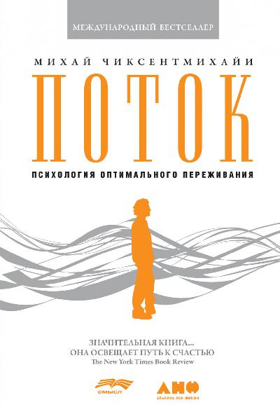
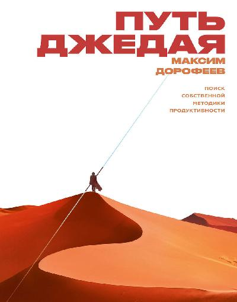
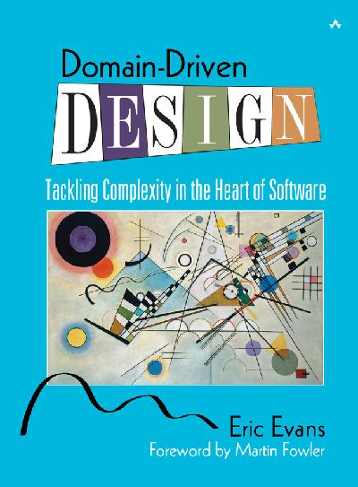

В этом году я прочитал 5 книг. В первую очередь я хотел начать осваивать soft-skills. Но не обошлось без технической и художественной литературы. Несколько книг были очень полезные и я их готов рекомендовать.
 <!--more-->

## Книги для развития soft-skills
### Поток - психология оптимального переживания. Михай Чиксентмихайи

Книга о том, как быть счастливым в современном обществе. Автор считает, что главный источник счастья - это переживание состояния потока. Поток - это состояние, когда мы сильно увлечены своим занятием.

Культура и общество нас научило, что работа это тяжело и нужно стремится избегать её, не нагружать себя сложными задачами. Но на самом деле, когда мы отдыхаем, мы не знаем чем себя занять, испытываем дискомфорт, а иногда даже страх, поэтому стремимся заполнить пустоту. Но когда мы работаем над сложной задачей, мы можем увлечься ею, нам может быть интересно, и достигнув результата мы испытываем счастье. Это счастье сильно отличается от того, которые вызывается легкими путями (развлечения, наркотики или просмотр коротких роликов, мемов и т.д).

Автор описывает основные составляющие состояния потока, без которых его трудно достичь, вот некоторые из них:
- Достаточно сложная деятельность, но не слишком.
- полная концентрация на задаче, не должно быть посторонней тревоги или выполнения нескольких задач одновременно.
- ясная цель и обратная связь. Чем раньше ты видишь результат своей деятельности, тем интереснее.
 - парадокс контроля. Если нет беспокойства о том, что потерпишь неудачу, то гораздо легче войти в состояние потока. Чем менее рисковая ситуация, тем выше ощущение контроля. Концентрация возникает не от реального контроля, а от уверенности, что сложная проблема будет преодолена. Но небольшое волнение тоже повышает концентрацию и состояние потока достигается быстрее.

Так же он описывает препятствия для вхождения в это состояние. Это, например, очень рутинная и простая задача (в этом случае можно искать способы сделать рутину интереснее) или повышенная сосредоточенность на себе.

Состояние потока можно достигать во множестве разных сфер: в работе, обучении, играх, искусстве. 

Минус этой книги в том, что автор достаточно много повторяется, и есть немного воды, некоторые главы из-за этого я пропустил. Но в книге все равно очень много интересных мыслей.

Книга позволила мне взглянуть на свою жизнь по другому, изменить свои ценности. Например, я понял, почему стремление быстрее выйти на пенсию не оправданны. Я начал больше искать пути сделать свой рабочий процесс интереснее, получать удовольствие от простых вещей. Наверное это лучшая для меня книга в этом году.

### Путь джедая. Максим Дорофеев

Книга с набором разных приемов повышения эффективности труда. Автор предлагает повышать свою эффективность, продвигаясь постепенно по уровням, всего 5 уровней.
- 1-й уровень - научиться отдыхать и избавиться от тревог, построить систему восстановления.
- 2-й уровень - научиться не допускать авралов на работе, предупреждать ошибки и наладить личную жизнь, без которой невозможно развиваться в работе.

Это пока все, что я прочел. Автор предлагает делать все постепенно и не пытаться научиться всему сразу, а ввести в привычку то, что узнал. Потому я решил остановиться на этом уровне.

На каждом уровне есть набор приемов, советов и отзывы других людей по каждому приему. Поэтому можно самому решить, что для себя больше подходит.
Все советы очень сжаты и без воды.

### Харизма. Как влиять, убеждать и вдохновлять. Оливия Фокс Кабейн
Мне хотелось научиться лучше коммуницировать с людьми, лучше доносить свои мысли, убеждать других в работе. Но я не знал как это все работает.

В этой книге я узнал о том, какие есть помехи в достижении харизматичного состояния. Узнал о психологических приемах преодоления волнения при выступлениях, переговорах.
Автор разделяет харизму на 3 компонента: присутствие, силу и теплоту. Эти понятия подробно раскрываются и описывается то, чем они помогают, как их развивать.

В этой книге много воды и лишних (по моему мнению) примеров. Книгу наверное можно было бы уменьшить в 3 раза без каких либо потерь. Её нет смысла читать, если не тренироваться и не попадать в стрессовые ситуации, в которых можно развивать харизму (это выступления, переговоры, новые знакомства).

Я её не дочитал, прочел только 6 глав, этого хватило сполна для моих целей. Главное в этом навыке - это практика.

## Техническая литература
### Domain Driven Design. Эрик Эванс

Достаточно сложная книга о проектировании информационной системы через предметную область. Её лучше читать, если есть опыт работы в крупных проектах, либо проектах со сложной предметной областью. Так же, перед тем, как читать эту книгу, лучше уже понимать, что такое DDD и посмотреть примеры кода, написанные в этом стиле.

Я начинал читать эту книгу сначала, но потом понял, что лучше начинать с середины, с главы о стратегическом проектировании.
Главная мысль в том, что в большинстве проектов лучше всего вынести знания о предметной области в отдельный слой (модуль или папку), а другие знания вынести за пределы этого слоя.

Т.е. знание об инфраструктуре, какая база данных используется, какие запросы в базу отправляются, или в какую АПИ мы ходим для получения или отправки информации скорее всего следует вынести за пределы слоя прикладной области. Все понятия бизнеса, правила и регламенты должны быть отражены в коде. Команда разработчиков должна общаться на одном языке с бизнесом.

Эту книгу стоит читать, если вы хотите углубиться и начать применять DDD у себя в проекте. Но для поверхностного ознакомления я бы рекомендовал почитать или посмотреть что-то попроще.

## Художественная литература
### Конец вечности. Айзек Азимов
Это художественное произведение об организации, которая научилась перемещаться во времени и использовала это изобретение для изменения хода истории человечества. Книга о парадоксах времени и развитии общества.

В этом романе автор пытается передать мысль о том, что чем больше мы пытаемся сделать наше общество безопаснее и сохранить стабильность, тем больше создается ограничений и общество упускает возможности в развитии.

Я выбрал эту книгу, потому что она считается одной из лучших работ Айзека Азимова, но мне она не очень понравилась. Возможно я встречал уже много рассказов связанных с парадоксами времени и книга меня ничем не удивила и не дала ярких эмоций. Рассказ "Игра Эндера", которую я [прочел в прошлом году](/posts/books2020/#%D0%BE%D1%80%D1%81%D0%BE%D0%BD-%D1%81%D0%BA%D0%BE%D1%82%D1%82-%D0%BA%D0%B0%D1%80%D0%B4---%D0%B8%D0%B3%D1%80%D0%B0-%D1%8D%D0%BD%D0%B4%D0%B5%D1%80%D0%B0) была намного интереснее.

## Вывод
Этот год был наименее удачный в выборе книг чем прошлый, но несколько книг мне очень понравились и я бы посоветовал их для прочтения, это:
- Поток - психология оптимального переживания. Михай Чиксентмихайи
- Путь джедая. Максим Дорофеев.

Мне они однозначно помогли.