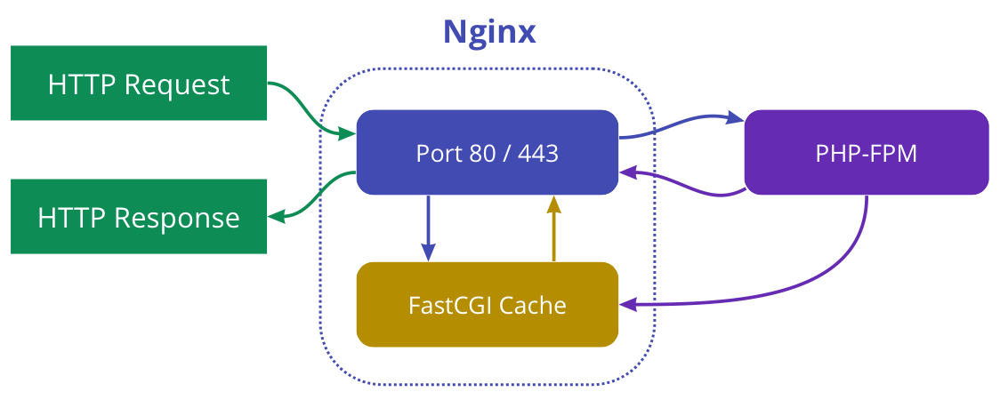

Для того, чтобы ускорить запросы и разгрузить сервер, разработчик в первую очередь задумывается над тем, чтобы использовать кеширование. Но кэширование можно делать на разных уровнях.
В этой статье я рассмотрю возможные уровни, на которых можно применить кэш и какой уровень выбрать в разных ситуациях.
 <!--more-->

### На стороне клиента
На этом уровне, данные, полученные при первом запросе сохраняются у клиента и повторно клиент уже не обращается за данными совсем. Если это web приложение, то данные сохраняются в браузере. В мобильном приложении это могут быть данные, сохраненные в локальной базе данных, например sqlite.

В браузере создать кэш быстрее всего. Достаточно передать заголовок Expires, с датой, до которой кэш будет жить.  
Этот способ самый быстрый и наименее ресурсозатратный на сервере, и практически не требует доработок кода в web-приложении.  
Такой кэш тяжело контролировать, потому что клиент не сможет получить информацию о том, что кэш устарел раньше времени. Он попросту не делает никаких запросов на сервер. В этом и смысл кэша. Пока у пользователя не протухнет кэш, данные не изменятся и он не отправит запрос.  
Отсюда происходит и преимущество такого кэширования. Этот запрос настолько оптимизируется, что не делается совсем и не используется сетевой трафик.  

Но есть другая проблема - кэширование происходит один раз на каждого клиента. Если бы кэш был сразу на всех, то его можно было бы один раз подготовить и больше не делать обработок запроса. Но если клиенты делают запросы редко, но самих клиентов много, то тогда кэширование на стороне клиента становится бесполезным.

### На уровне nginx сервера

Кэширование происходит следующим образом - при первом запросе клиента nginx сервер пересылает запрос в бэкенд и получает результат обработки запроса. Затем он сохраняет в кэш результат обработки и отдает ответ с этими результатами клиенту. При следующем таком же запросе от любого клиента, он уже не будет обращаться к бэкенду, а возьмет сохраненный результат из кэша и вернет ответ.

Настройка кэширования происходит преимущественно настройками [fastcgi_cache_bypass](http://nginx.org/ru/docs/http/ngx_http_fastcgi_module.html#fastcgi_cache_bypass) и [fastcgi_cache_key](http://nginx.org/ru/docs/http/ngx_http_fastcgi_module.html#fastcgi_cache_key).  
Преимущество метода в том, что мы кэшируем ответ целиком и нам не нужно ничего дорабатывать на бэкенде. Код на бэкенде останется проще.  
Но такому кэшированию желательно быть очевидным. Чтобы мы могли отличать кэшируемые запросы от не кэшируемых. Например в кэшируемых запросах, в ссылке указывать явно директиву cached так: `http://api.site.ru/path/cached` . Это нужно на тот случай, если из каких-то мест будет нужно брать не кэшированный ответ и понимать, где есть кэширование, а где нет, не копаясь в конфигах nginx.

### На уровне backend сервера
Тут уже мы можем выбирать, какую часть данных будем кэшировать, а какую получать по новой. Сохранение данных происходит по ключу.

Самая распространенная технология - **memcached**. Она позволяет сохранять данные в оперативной памяти, и быстро получать их по ключу. Недостаток в том, что она имеет ограничение в 1 Мб на хранимое значение, в случае перезагрузки memcached сервера, все данные в кэше будут потеряны.  
Более сложная технология, которая позволяет хранить в оперативной памяти и в фоне сохранять данные в постоянную память - **redis**. Она имеет больше памяти для хранения значений, но и требует немного больше ресурсов чем memcached.  
Memcached стоит выбирать при кэшировании небольших кусков данных, к которым происходит очень частое обращение. При этом долговечность хранения данных в кэше не сильно критична. Если же вы хотите возможности сложной настройки кэширования, тогда выбирайте redis.

При работе с кэшированием по ключу нужно учитывать, что возможно тяжелое кэширование. Если мы долго готовим данные, перед тем как их сохранить в кэш (например выполняем тяжелый запрос в базу), возникает промежуток времени, в котором кэш ещё не готов, но пользователи могут запрашивать данные из этого кэша. В этот момент кэш начнет формироваться повторно. Защититься от перегрузок в такой момент можно например при помощи [дублирования кэшей](https://ruhighload.com/Тяжелое+кэширование).

Более подробная статья про memcached и redis - https://habr.com/ru/company/oleg-bunin/blog/316652/

### Кэширование на уровне БД
Многие базы данных могут сами кэшировать запрашиваемые данные.  
Но может возникнуть вопрос - почему бы не использовать memcached вместо кэша внутри базы? Дело в том, что база данных может сама контроллировать свежесть данных в себе. И если в кэше данные будут старее чем в самой базе, она обновит этот кэш. Т.е. пользователю БД не нужно думать над обновлением кэша.  
Про кэширование в mysql - https://habr.com/ru/post/41166/  
В mongodb - https://habr.com/ru/post/219481/  