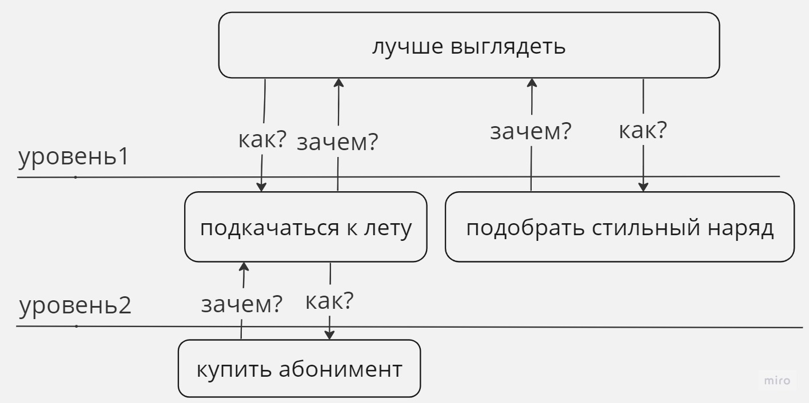

В своей работе я часто сталкиваюсь с ситуацией, когда нужно придумать, как решать задачу и какое решение самое подходящее. Когда я сталкивался с такими проблемами мне часто казалось, что есть только одно решение, не очень хорошее, но единственное, и ничего другого с этим сделать нельзя либо решения вообще нет. Но это почти всегда оказывалось не так.  
В этой статье я хочу разобраться, как подходить к проблеме, как находить решения и как принимать по ним решение.
 <!--more-->

## 1 этап - контекст проблемы
Итак, перед нами есть проблема. Нам для начала нужно понимать проблему, т.е. четко её поставить. Я стараюсь поставить проблему в 1-2 предложения. Т.е. не пытаться рассказать историю, а именно указать на итоговую проблему. Уже на этом этапе могут быть сложности. Например, мы можем осознать, что проблем несколько, они разные и можно решать их по отдельности. Или проблемы на самом деле нет.  
Затем нужно описать полный контекст: как эта проблема появилась, кому она вредит или мы упускаем возможности, с чем эта проблема связана. Почему нам она кажется серьезной и мы думаем что её нужно срочно решать.  
Это нужно для того, чтобы лучше справиться со следующими этапами.  

### Общение с уточкой
Вы должны подробно описать проблему кому-то. Если вы не хотите отнимать чужое время, то вместо другого человека подойдет например игрушечная уточка.  
Нужно описать максимально подробно проблему уточке и задать ей уточняющие вопросы по проблеме. Нужно спрашивать её так, как будто вы просите помощи у нее. И пытаетесь ей объяснить проблему так, чтобы она все поняла. Чудесным образом решение может всплыть само.  
Источник: книга Программист прагматик - Томас, Хант.  

Так же иногда помогает объяснение в текстовом виде. Например, со мной часто происходило следующее: я долгое время не мог придумать как решать проблему и решил написать своему коллеге, чтобы он мне помог. Но пока я писал текст, у меня появлялось понимание того, что я чего-то не знаю или не понимаю, и начинал эти вопросы самостоятельно уточнять. После того, как я их уточнял, решение становилось очевидным и спрашивать стало уже не нужно.  
Почему бы тогда сразу не начать с текста, если понимаешь, что готового решения с ходу не придумать.  

### Лестница абстракций
Источник: [Abstraction laddering](https://untools.co/abstraction-laddering)  
Прием, который позволяет правильно определить проблему и задать правильные вопросы.  
Пример как это работает. Перед нами стоит проблема - "Как подкачаться к лету?" И тут могут появиться варианты. Например, взять абонемент в спортзал (тут вы опускаетесь на ступень ниже по лестнице, теперь проблемой является как взять абонемент). Но кроме этого ещё стоит задаться вопросом, а зачем мне подкачиваться к лету, ответом может быть - чтобы лучше выглядеть, и тут возникнет вопрос - "Как лучше выглядеть?" (это поднятие на ступень выше по лестнице абстракций). И ещё одним решением на этом уровне будет например "подобрать стильную одежду". Таким образом, можно перескакивать на разные ступени и пытаться решать проблему шире или найти более короткие пути.  
Алгоритм следующий. Начать нужно с текущей поставленной проблемы. Затем задать вопрос "Как решить эту проблему?". Ответив на этот вопрос можно перейти на более высокий уровень абстракции и ответить на вопрос "Зачем?" для изначально поставленной проблемы и попробовать ответить на вопрос "Как?" уже для более высокоуровневой проблемы.  

## 2 этап - генерация идей
Допустим проблема четко определена, теперь нужно выработать идеи, как её решать. Лучше всего когда у нас есть несколько решений. Как найти эти решения? Рассмотрим варианты.  

### Ничего не делать
Первой идеей должна быть - не решать эту проблему. Что случиться, если ничего не делать? Сколько стоит жить с этой проблемой? Насколько дорого для нас переключаться на эту проблему и решать её вместо других? Может ли она решиться сама со временем? Этот вопрос позволяет провалидировать проблему. Понять её важность и срочность.  
Если мы думаем, что оставить её нерешенной не можем или не хотим, то тогда нам нужно начать генерировать идеи. К этому вопросу можно вернуться потом, после рассмотрения других вариантов, если они окажутся очень дорогими. Ничего не делать может оказаться выгодней.  

### Генерация идеи через ошибки
Источник: The 5 elements of effective thinking - Edward B. Burger.  
Представьте, что у вас бесконечно ресурсов, времени, возможностей. Затем подумайте, как в таких условиях вы бы решали свою проблему. Эта идея будет изначально нереальной для выполнения. Затем, когда вы придумали, вам нужно начать убирать лишнее из этой идеи. Убирайте из нее лишнее, пока не останется суть этой идеи, основной принцип решения. Потом, имея суть вы можете начать думать в обратную сторону. Подумайте, как применить этот принцип к своей проблеме? Добавляйте нюансы к решению, которые реальны для выполнения.  
Например: я готовил доклад про то, как работает поиск на сайте, составил пару слайдов и у меня закончились идеи для следующих слайдов. Я подумал, что если бы у меня было бесконечно времени, я бы рассказывал о каждом нюансе проблемы очень подробно, рассказывал бы весь день, показывая примеры страниц на сайте с поиском, код, архитектуру приложения. Затем я выкинул из этой идеи лишнее, и осталась только суть - нужно разбить уже сделанные слайды на более подробные и оставить только самые важные, что относятся к цели доклада.  
Суть в том, что ошибки помогают быстрее двигаться. Выдвигая ошибочную идею, вы можете уже начать с чем-то работать, вместо того, что сидеть перед чистым листом. Уже имея какой-то набросок, его можно улучшать, убирать лишнее.  

### Мозговой штурм
Это методика, которая проводится в группе.  
Если коротко, нужно собрать группу людей, рассказать им о проблеме, вместе сгенерировать как можно больше идей, можно даже очень глупых. Затем объединить похожие идеи в группы, а самые не подходящие убрать. После углубиться в объединенные идеи, попробовать добавить в них ограничения или наоборот дополнить.  
О ней написано уже много статей, я не стану повторяться.  

## 3 этап - принятие решений
У вас уже есть набор идей. Но какое решение будет самым лучшим? Для выбора лучшего решения есть несколько инструментов.

### Матрица решений
Источник [Decision matrix](https://untools.co/decision-matrix)  
Нужно составить таблицу в которой:
1) Определить список вариантов решения
2) Определить список факторов, влияющих на принятие решений
3) Выставить балл каждому фактору (например от 1 до 5)
4) Определить вес каждого фактора (то, насколько важен этот фактор для вас)
5) Просуммировать балл каждого фактора умноженного на вес. Это будет итоговым баллом для решения
6) Выбрать то решение, которое имеет наибольший балл

### Метод "6 шляп" (Six Hats) 
Источник: [Six Thinking Hats](https://untools.co/six-thinking-hats)  
Метод поможет посмотреть на проблему с разных сторон и принять решение. В этом методе нужно каждую идею рассмотреть с 6-ти точек зрения, в методе они называются шляпами.
1. Желтая шляпа. Нужно рассмотреть позитивные стороны решения. Сколько пользы и возможностей оно даст?
2. Зеленая шляпа. Представляет собой креативность. Нужно рассмотреть способы решения разных вариантов. Пофантазировать над идеей. Как бы она работала?
3. Красная шляпа. Нужно раскрыть эмоции. Какие есть опасения и риски? Что подсказывает интуиция? Не кажется ли идея скучной и неинтересной?
4. Белая шляпа. Проверьте все данными. Найдите данные подтверждающие или опровергающие ваши опасения.
5. Черная шляпа. Нужно рассмотреть негативные стороны решения или идеи. Какой наихудший сценарий может произойти, если мы пойдем выбранным путем? Каковы вероятности негативных сценариев? Какие есть недостатки решения?
6. Голубая шляпа. Тут нужно все сопоставить и сделать выводы по результатам размышлений в прошлых шляпах. Основное - это задаться правильными вопросами. В этой шляпе по итогу мы и должны принять конечное решение.

Шляпы можно надевать в любом порядке и надевать по несколько раз по необходимости. Сам метод не содержит в себе алгоритма принятия решения, как в матрице решений. Он позволяет подходить к проблеме более гибко, смотреть на проблему шире. Ещё он помогает расширить свое мышление, если вы привыкли мыслить в узких рамках, например, больше критиковать, то осознанное переключение в другой тип мышления позволит избежать этого.
Мне кажется, его следует применять для принятия наиболее ответственных решений, потому что он позволяет проработать проблему с очень разных сторон и ничего не упустить, но требует много времени на проработку. Ещё она может быть полезна в повседневных задачах, при решении каких-либо ответственных задач. Например: покупка квартиры, машины, переезд и т.д.

### Эксперименты
Если у вас есть много идеи, но вы не знаете насколько эти идеи подходят или вы не знаете, что придуманное решение действительно поможет, то нужно придумать как эту идею проверить. Нужно придумать быстрый, дешевый эксперимент, который покажет действительно ли это решение работает и насколько хорошо оно поможет.

# Итог
Принятие решений - это процесс, который может быть очень простым и очень сложным. Мы сами решаем как к нему подходить. Неразумно использовать очень сложные подходы для принятия незначительных решений. Но если от этого решения зависит очень многое, то стоит заранее иметь под рукой инструменты для этого. Но одних инструментов мало, нужно ещё уметь их применять, для этого нужна практика.
Для меня эти инструменты показались крайне интересными ещё потому, что они универсальны для разных областей. Их можно применять не только в IT.

Другие инструменты - которые  я ещё не изучил или не применял:  
- каталог инструментов https://untools.co
- Для более системного подхода к решению проблем можно рассматривать Кеневин фреймворк https://www.youtube.com/watch?v=hoDwEt3r-IA
- Ментальные модели https://fs.blog/mental-models/