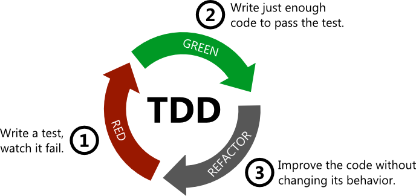

Интерес в работе - это главное, что помогает учиться, лучше работать и зарабатывать больше денег. Чтобы разобраться почему работа становится неинтересной, я решил начать с поиска причин падения интереса в своей работе и нашел несколько:
- Увеличение количества рутины
- Очень сложные задачи, из-за которых работа не продвигается
- Упадок сил
 <!--more-->

## Бороться с рутиной и сложностью можно с помощью некоторых приемов

### 1. Автоматизируйте все, что можно
Если есть какая-то ручная работа, которая займет больше часа, напишите скрипт, который сделает это за вас. Причем, на написание скрипта можно потратить столько же времени, сколько на ручную работу, но это интереснее и дает дополнительные навыки.  
Например: чтобы собрать нужные куки с интернет-магазина для разных городов можно написать скрипт с использованием Селениума.
Или вместо того, чтобы писать простой код для разбора json полей из ответа API, можно пользоваться утилитой jq.  
Автоматизировать работу также помогает IDE, об этом я написал в [отдельной статье](/posts/most_useful_techniques/).  
Идея в том, чтобы рутинную задачу превратить в возможность для обучения и, в идеале, избавиться от нее. Это гораздо выгоднее, потому что рутина отбирает время и не дает ничего взамен.

### 2. Практиковать TDD (разработка через тестирование)
Это одна из практик экстремального программирования (XP). Её принцип в том, чтобы для некоторой функциональности сначала написать тест, затем её реализацию. Основной смысл этого подхода - максимально упростить процесс написания кода, не удерживая в голове все сценарии и писать код итеративно. Начинать нужно с самого простого теста, затем убедится, что он **не** работает, написать реализацию, при которой тесты будут проходить, и отрефакторить код. Этот цикл повторяется пока не будут учтены все кейсы в тестах.  
  
С помощью этого подхода легче писать сложный код, и на каждой итерации есть уверенность в том, что маленькими изменениями не поломается вся функция. Это дает психологическую поддержку. Каждое новое изменение дается достаточно легко, не так страшно что-то менять и всегда есть тесты для прошлых сценариев.  
Ещё очень полезно использовать этот подход для новых багов. Когда выясняется, что есть баг, вы сначала пишите новый тест, затем на тестах убеждаетесь, что баг воспроизводится, а потом чините его.
> Лучший способ научиться применять TDD, это решать каты, например [такую](https://osherove.com/tdd-kata-1)

### 3. При решении сложных задач озвучивайте проблему
Не зная как решить задачу, можно долго прокрастинировать, не понимая как подступиться к задаче. Из-за этого тратится много времени впустую, а вы можете начать чувствовать себя никчемным.
Хорошим приемом в таком случае будет просто описать проблему, подробно объясняя нюансы или просто рассказать проблему игрушечной уточке. Иногда, не зная как решить задачу, я начинаю писать вопрос в чате своим коллегам. Но перед тем как отправить его, перечитываю заново, поправляю сам вопрос и перечитав его появляются новые идеи. В итоге я сам нахожу решение, так и не отправив вопрос.  
Смысл в том, что формулируя вопрос, вы приходите к лучшему пониманию проблемы. А задав правильный вопрос, гораздо проще сделать предположения и найти правильный ответ.

### 4. Ревью кода своих коллег
Не во всех компаниях распространена практика ревью кода, но это классная штука. Она помогает развивать навык погружения в чужую задачу, учит быстрее разбираться в чужом коде и узнавать недостатки разных подходов. Кроме того, вы обсуждаете разные решения и оттачиваете свои навыки программирования. Ревью помогает немного отвлечься от своей задачи и в ускоренном режиме позаниматься чужой. Это как решать задачу, но при этом не писать код, а только указывать на недочеты и находить ошибки.

### 5. Дробить задачи
Это наверное лучший из приемов для уменьшения сложности задачи. Не нужно стремиться сделать все сразу. Лучше делать по частям.
Например, вам нужно добавить фичу, но код, в котором нужно это сделать очень сложный. В нем невозможно разобраться. Не нужно сразу пытаться добавить фичу, для начала достаточно сделать код немного понятнее (отрефакторить его). Затем убедиться, что ничего не сломалось и выложить упрощенный код. И потом, зная как все работает, и имея дело с понятным кодом, можно усложнить его, добавив новую фичу.

## Упадок сил
Самая труднорешаемая причина, по моему мнению - это упадок сил. Он может быть из-за проблем со здоровьем, переработок, проблем в жизни. Их контролировать тяжелее всего, но частично можно. Мы можем управлять своим образом жизни.
- **Хорошо высыпаться.** Чтобы меньше уставать, поддерживать баланс гормонов и хорошо восстанавливаться после работы.
- **Больше двигаться.** Работа программистом вынуждает долго сидеть. Из-за этого возникает очень много проблем. Это может быть головная боль, плохое настроение, проблемы со спиной. Это все тормозит развитие, и со временем начнет забирать все внимание. Самое простое - это гулять перед работой и после по 30-60 минут.
- **Пить витамины и нормально питаться.** Повышенная умственная нагрузка требует дополнительных ресурсов от организма. Не нужно пить все витамины и комплексы, а только те, которые в недостатке. Почти у всех есть недостаток витамина D (из-за того, что мы работаем в офисе и не получаем достаточно “солнца”). Нормальной работе мозга помогает йодомарин. Остальное индивидуально.
- **Иметь хобби.** Если заниматься только программированием, то через какое-то время оно полностью надоест. Нужно переключать внимание (но только не во время работы).